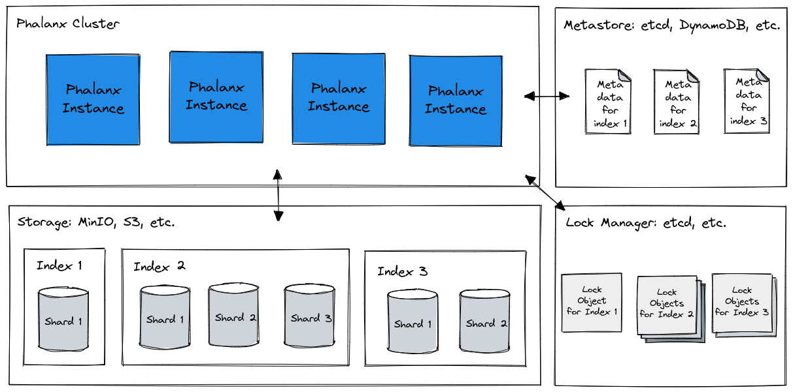

# Phalanx

Phalanx is a cloud-native distributed search engine written in [Go](https://golang.org) built on top of [Bluge](https://github.com/blugelabs/bluge) that provides endpoints through [gRPC](https://grpc.io/) and traditional RESTful API.  
Phalanx implements a cluster formation by [hashicorp/memberlist](https://github.com/hashicorp/memberlist) and managing index metadata on [etcd](https://etcd.io/), so it is easy to bring up a fault-tolerant cluster.  
Metrics for system operation can also be output in Prometheus exposition format, so that monitoring can be done immediately using [Prometheus](https://prometheus.io/).  
Phalanx is using object storage for the storage layer, it is only responsible for the computation layer, such as indexing and retrieval processes. Therefore, scaling is easy, and you can simply add new nodes to the cluster.  
Currently, it is an alpha version and only supports [Amazon S3](https://aws.amazon.com/s3/) and [MinIO](https://min.io/) as the storage layer, but in the future it will support [Google Cloud Storage](https://cloud.google.com/storage), and [Azure Blob Storage](https://azure.microsoft.com/en-us/services/storage/blobs/).  


## Architecture

Phalanx is a master node-less distributed search engine that separates the computation layer for searching and indexing from the storage layer for persisting the index.
The storage layer is designed to use object storage on public clouds such as [Amazon S3](https://aws.amazon.com/s3/), [Google Cloud Storage](https://cloud.google.com/storage), and [Azure Blob Storage](https://azure.microsoft.com/en-us/services/storage/blobs/).

Phalanx makes it easy to bring up a distributed search engine cluster. A phalanx cluster simply adds nodes when its resources are run out. Of course, it can also simply shut down nodes that are not needed. Indexes are managed by object storage, so there is no need to worry about index placement. No complex operations are required. Clusters are very flexible and scalable.

Phalanx stores index metadata in etcd. The metadata stores the index and the path of the shards under that index. The nodes process the distributed index based on the metadata stored in etcd.

Phalanx also uses etcd as a distributed lock manager to ensure that updates to a single shard are not made on multiple nodes at the same time.




## Build

Building Phalanx as following:

```bash
% git clone https://github.com/mosuka/phalanx.git
% cd phalanx
% make build
```

You can see the binary file when build successful like so:

```bash
% ls ./bin
phalanx
```


## Table of Contents

* [Get started](./docs/get_started.md)
* [Metadata Store](./docs/metadata_store.md)
* [Index Store](./docs/index_store.md)
* [Lock Store](./docs/lock_store.md)
* [Index Metadata](./docs/index_metadata.md)
* [Index Mapping](./docs/index_mapping.md)
* [Analyzer](./docs/analyzer.md)
  * [Char filters](./docs/analyzer/char_filters.md)
  * [Tokenizers](./docs/analyzer/tokenizers.md)
  * [Token filters](./docs/analyzer/token_filters.md)
* [Queries](./docs/queries.md)
* [Aggregations](./docs/aggregations.md)
* [Highlights](./docs/highlights.md)
* [RESTful API](./docs/restful_api.md)
  * [Create Index API](./docs/restful_api/create_index_api.md)
  * [Delete Index API](./docs/restful_api/delete_index_api.md)
  * [Add Documents API](./docs/restful_api/add_documents_api.md)
  * [Delete Documents API](./docs/restful_api/delete_documents_api.md)
  * [Search API](./docs/restful_api/search_api.md)
* [Bringup a multi-node cluster](./docs/bringup_cluster.md)
* [Run with MinIO and etcd](./docs/run_with_minio_etcd.md)
* [Run with AWS](./docs/run_with_aws.md)
* [Docker](./docs/docker.md)
